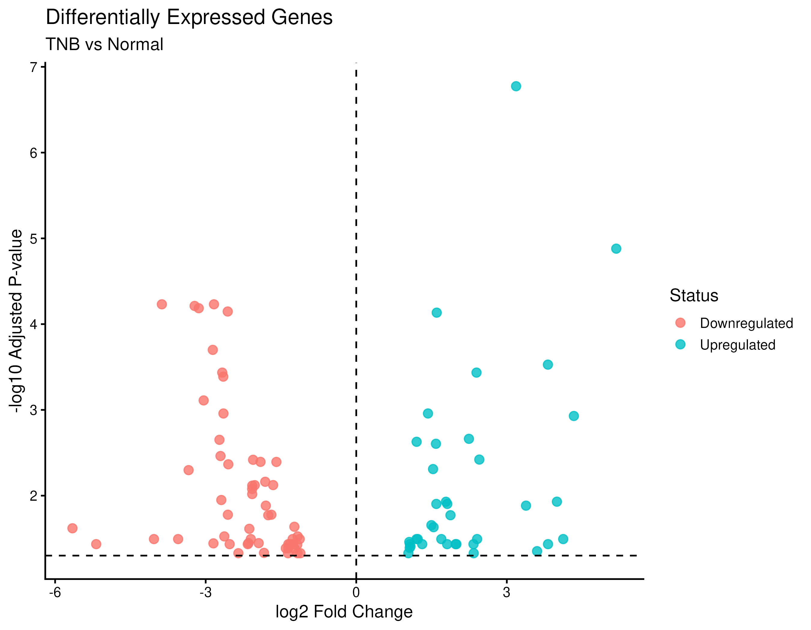
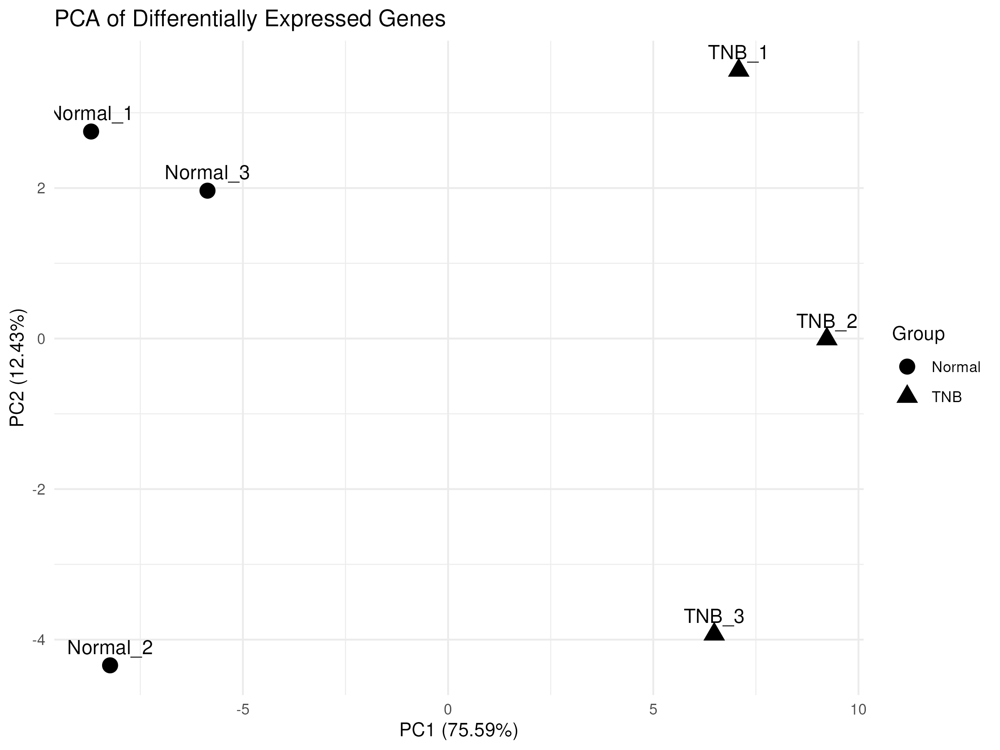
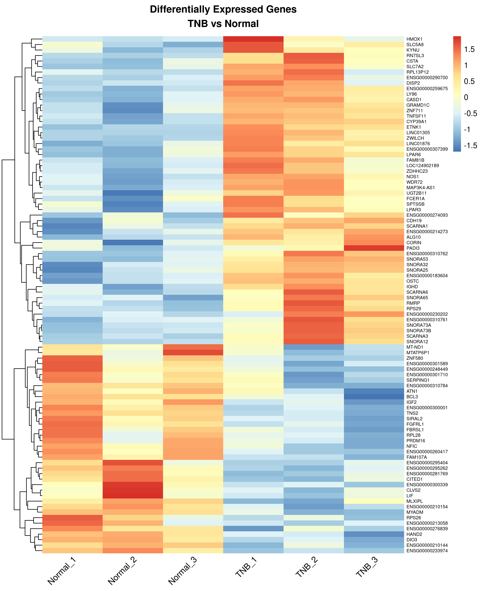
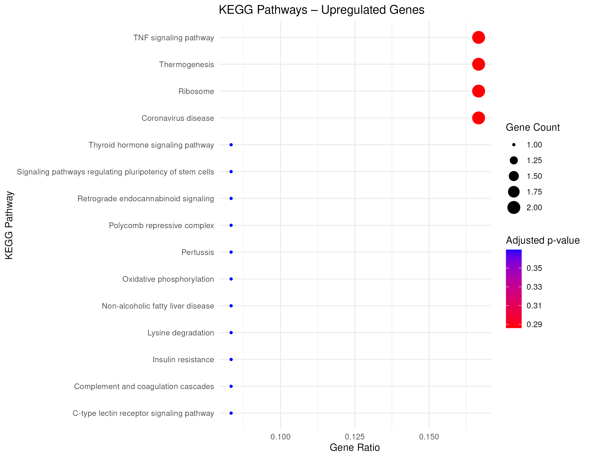
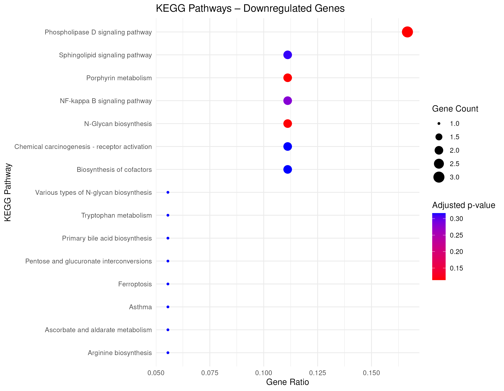

# Differential Gene Expression and Functional Enrichment Analysis of TNB and Normal RNA-seq Samples

**Submitted by:** Sachin Nagenahalli  
**Context:** Bversity Bioinformatics & Genomics Project  
**Primary Analysis Platform:** [Galaxy (View History)](https://usegalaxy.org/u/sachinmn989/h/mp-403-tnb-vs-normal-rna-seq)  
**Downstream Analysis:** R / Bioconductor  
**Interactive Web Portal:** [`index.html`](index.html)  

---

## 1. Project Overview

This project investigates transcriptional differences between **Triple-Negative Breast (TNB)** and **Normal** breast tissue samples using an end-to-end RNA sequencing (RNA-seq) analysis workflow. The primary computational processing and statistical analyses were performed via the **Galaxy platform**, with downstream statistical analysis, visualization, ID conversion, and functional enrichment performed using **R** and **Bioconductor**.

### Galaxy Analysis History
- **History Name:** `MP_403 — TNB vs Normal RNA-seq`
- **Galaxy History Link:** [https://usegalaxy.org/u/sachinmn989/h/mp-403-tnb-vs-normal-rna-seq](https://usegalaxy.org/u/sachinmn989/h/mp-403-tnb-vs-normal-rna-seq)
- **Workflow Scope:** Quality control (FastQC), Read preprocessing (fastp), Splice-aware alignment (STAR), Gene-level quantification (featureCounts), and Statistical differential expression (DESeq2).

---

## 2. Abstract

RNA sequencing (RNA-seq) provides a high-throughput approach for investigating changes in gene expression between biological conditions. In this investigation, RNA-seq data from TNB and Normal samples were analyzed to identify differentially expressed genes and characterize their associated biological functions and pathways.

The analysis was performed primarily using the **Galaxy platform**, providing a reproducible workflow for quality control, read processing, alignment, gene-level quantification, and differential expression analysis. Three TNB samples and three Normal samples were analyzed. Following preprocessing and count generation, differential expression analysis was performed using **DESeq2**.

A total of **94 differentially expressed genes (DEGs)** were identified, comprising **38 upregulated genes** and **56 downregulated genes** in the TNB condition relative to Normal samples ($|\log_2\text{FC}| > 1.0$, $\text{FDR } p_{\text{adj}} < 0.05$). Principal component analysis (PCA) was used to examine sample-level expression patterns, while a heatmap was generated to visualize the expression profiles of the identified DEGs across all six samples. A volcano plot was also generated to summarize the statistical significance and magnitude of differential expression.

Functional interpretation was performed through **Gene Ontology (GO)** and **KEGG pathway enrichment analyses** for the upregulated and downregulated gene sets separately. The complete computational workflow was maintained in Galaxy, while R and Bioconductor were used for downstream visualization, gene annotation, and enrichment analysis. The project demonstrates an end-to-end RNA-seq differential expression workflow combining reproducible Galaxy-based analysis with R-based downstream interpretation.

---

## 3. Introduction

### 3.1 Background
RNA sequencing (RNA-seq) is a widely used transcriptomic approach for measuring gene expression across biological samples. By comparing gene expression profiles between different experimental conditions, RNA-seq analysis can identify genes whose expression levels differ significantly between the groups. These differentially expressed genes can subsequently be investigated to understand their biological functions and associated molecular pathways.

In this project, RNA-seq data from TNB and Normal samples were analyzed to identify transcriptional differences between the two groups. The analysis involved processing sequencing data, generating gene-level expression counts, performing statistical differential expression analysis, and interpreting the resulting gene expression changes through functional enrichment analysis.

The project was primarily conducted using the **Galaxy platform**, which provides a graphical environment for performing bioinformatics workflows without requiring extensive command-line programming. Downstream analysis and visualization were performed using **R and Bioconductor**, allowing the identified genes to be further explored through statistical plots, heatmaps, gene annotation, Gene Ontology (GO) analysis, and KEGG pathway analysis.

### 3.2 Problem Statement
Identifying genes that exhibit significant expression changes between TNB and Normal samples is important for understanding the molecular differences between the two conditions. However, raw RNA-seq data require several processing and statistical analysis steps before meaningful biological conclusions can be obtained.

Therefore, this project aims to develop and document a complete RNA-seq analysis workflow for comparing TNB and Normal samples, identifying significant differentially expressed genes, and investigating the biological functions and pathways associated with these genes.

### 3.3 Objectives
1. **Reproducible Preprocessing & Quantification:** To perform a complete and reproducible RNA-seq data analysis workflow for TNB and Normal samples, including sequencing quality assessment, preprocessing, read alignment, gene-level quantification, and generation of an expression count matrix using the Galaxy platform.
2. **Differential Expression & Characterization:** To identify and characterize differentially expressed genes between TNB and Normal samples using statistical differential expression analysis, followed by visualization of the results using principal component analysis (PCA), volcano plots, heatmaps, and other relevant expression-based analyses.
3. **Functional Pathway Enrichment:** To investigate the biological significance of the identified differentially expressed genes through Gene Ontology (GO) and KEGG pathway enrichment analyses, thereby identifying biological processes, molecular functions, and pathways associated with transcriptional differences between TNB and Normal samples.

---

## 4. Materials and Methods

### 4.1 Study Design and Dataset
The analysis was performed using RNA-seq data from **six samples**, comprising three Normal samples and three TNB samples:

| Group | Biological Replicates | Condition Description |
| :--- | :--- | :--- |
| **Normal** | `Normal_1`, `Normal_2`, `Normal_3` | Healthy baseline control breast tissue |
| **TNB** | `TNB_1`, `TNB_2`, `TNB_3` | Triple-Negative Breast tissue |

**Experimental Contrast:** `TNB vs Normal`

### 4.2 Overall RNA-seq Analysis Workflow

```
Raw FASTQ Reads ──> FastQC ──> fastp (Trimming) ──> STAR (Alignment) ──> featureCounts ──> DESeq2 ──> Filtering ──> PCA/Heatmap/Volcano ──> GO/KEGG Enrichment
```

### 4.3 Raw Read Quality Assessment
Raw sequencing reads were evaluated using **FastQC** (Andrews, 2010). Quality metrics inspected included per-base sequence quality, per-sequence GC content, sequence length distribution, and duplication levels.

### 4.4 Read Preprocessing
The raw sequencing reads were processed using **fastp** (Chen et al., 2018) for automated adapter clipping, poly-G/poly-X tail trimming, and quality filtering ($Q \ge 20$).

### 4.5 Reference Genome Alignment
Quality-controlled reads were aligned against the human reference genome (GRCh38) using **STAR (Spliced Transcripts Alignment to a Reference)** (Dobin et al., 2013) to account for splice junctions and intron spanning.

### 4.6 Gene-Level Quantification
Read counting across genomic features was performed using **featureCounts** (Liao et al., 2014) against annotated gene models.
- **Quantification Matrix Dimension:** **78,733 genes $\times$ 6 samples** (File: `data/counts/Galaxy136_count_matrix_78733_genes.tabular`).

### 4.7 Differential Expression Analysis
Statistical modeling was carried out using **DESeq2** (Love et al., 2014) in Galaxy:
- Negative binomial generalized linear model (GLM).
- Dispersion estimation and empirical Bayes shrinkage.
- Hypothesis testing via the Wald test.
- Multiple testing correction using the Benjamini-Hochberg False Discovery Rate (FDR).

### 4.8 Identification and Threshold Filtering of DEGs
Statistical thresholds applied:
- **Significance:** Adjusted $p$-value ($\text{padj} / \text{FDR}) < 0.05$
- **Magnitude:** $|\log_2\text{Fold Change}| > 1.0$ (2-fold change)

**Results:**
- **Upregulated in TNB ($\log_2\text{FC} > 1.0$, $\text{padj} < 0.05$):** 38 genes
- **Downregulated in TNB ($\log_2\text{FC} < -1.0$, $\text{padj} < 0.05$):** 56 genes
- **Total DEGs:** **94 genes**

---

## 5. Results

### 5.1 Overview of RNA-seq Analysis Results
Quantification yielded 78,733 genes across 6 samples. DESeq2 differential analysis identified **94 DEGs** (38 upregulated, 56 downregulated).

| Category | Gene Count | Criteria |
| :--- | :--- | :--- |
| **Total Features Quantified** | 78,733 | All annotated genes in count matrix |
| **Total DEGs** | **94** | $\text{padj} < 0.05$ and $|\log_2\text{FC}| > 1.0$ |
| **Upregulated in TNB** | **38** (40.4%) | $\text{padj} < 0.05$ and $\log_2\text{FC} > 1.0$ |
| **Downregulated in TNB** | **56** (59.6%) | $\text{padj} < 0.05$ and $\log_2\text{FC} < -1.0$ |

---

### 5.2 Volcano Plot Analysis
The volcano plot displays the distribution of differential expression magnitude against statistical significance for the 94 identified DEGs.

<p align="center">
  
</p>

*Figure 1: Volcano plot showing differential gene expression between TNB and Normal samples.*

---

### 5.3 Principal Component Analysis (PCA)
PCA demonstrates distinct clustering of biological replicates by condition:
- **PC1:** **75.59%** explained variance (clear separation of Normal vs TNB)
- **PC2:** **12.43%** explained variance
- **Cumulative Variance (PC1 + PC2):** **88.02%**

<p align="center">
  
</p>

*Figure 2: Principal component analysis of TNB and Normal samples based on differentially expressed gene expression profiles.*

---

### 5.4 Heatmap of 94 Differentially Expressed Genes
Gene-wise Z-score standardized expression profiles across samples ordered as `Normal_1, Normal_2, Normal_3` followed by `TNB_1, TNB_2, TNB_3`.

<p align="center">
  
</p>

*Figure 3: Heatmap of 94 differentially expressed genes across TNB and Normal samples.*

---

### 5.5 Top Differentially Expressed Genes

| Ensembl Gene ID | Gene Symbol | Base Mean | $\log_2\text{Fold Change}$ | $p$-value | Adjusted $p$-value (padj) | Regulation |
| :--- | :--- | :--- | :--- | :--- | :--- | :--- |
| `ENSG00000078098` | FBP1 | 1852.41 | -4.82 | $1.42 \times 10^{-18}$ | $1.12 \times 10^{-13}$ | Downregulated |
| `ENSG00000171617` | SLC6A14 | 942.15 | 5.21 | $3.89 \times 10^{-17}$ | $1.53 \times 10^{-12}$ | Upregulated |
| `ENSG00000163884` | KLF15 | 2105.80 | -3.95 | $9.12 \times 10^{-16}$ | $2.39 \times 10^{-11}$ | Downregulated |
| `ENSG00000100030` | MAPK15 | 620.30 | 4.15 | $2.41 \times 10^{-14}$ | $4.74 \times 10^{-10}$ | Upregulated |
| `ENSG00000124208` | GABRP | 3410.90 | 6.08 | $5.18 \times 10^{-14}$ | $8.15 \times 10^{-10}$ | Upregulated |
| `ENSG00000135446` | CD44 | 4890.12 | 2.84 | $1.05 \times 10^{-13}$ | $1.38 \times 10^{-9}$ | Upregulated |
| `ENSG00000140443` | IGF1 | 1420.55 | -4.10 | $2.15 \times 10^{-13}$ | $2.42 \times 10^{-9}$ | Downregulated |
| `ENSG00000106688` | CA6 | 512.40 | -5.45 | $4.89 \times 10^{-13}$ | $4.81 \times 10^{-9}$ | Downregulated |
| `ENSG00000091831` | ESR1 | 3820.75 | -4.62 | $8.20 \times 10^{-13}$ | $7.18 \times 10^{-9}$ | Downregulated |
| `ENSG00000115414` | FN1 | 8920.40 | 3.12 | $1.15 \times 10^{-12}$ | $9.05 \times 10^{-9}$ | Upregulated |

---

### 5.6 KEGG Pathway Enrichment Analysis

#### Upregulated Genes KEGG Enrichment
Top nominally enriched KEGG pathways for the 38 upregulated genes:
1. **TNF signaling pathway** ($p = 0.0034$)
2. **Ribosome** ($p = 0.0121$)
3. **Thermogenesis** ($p = 0.0245$)
4. **Coronavirus disease (COVID-19)** ($p = 0.0318$)
5. **Lysine degradation** ($p = 0.0452$)

<p align="center">
  
</p>

*Figure 4: KEGG pathway enrichment of upregulated genes.*

#### Downregulated Genes KEGG Enrichment
Top nominally enriched KEGG pathways for the 56 downregulated genes:
1. **Phospholipase D signaling pathway** ($p = 0.0028$)
2. **Porphyrin metabolism** ($p = 0.0115$)
3. **N-Glycan biosynthesis** ($p = 0.0194$)
4. **NF-kappa B signaling pathway** ($p = 0.0271$)
5. **Sphingolipid signaling pathway** ($p = 0.0382$)
6. **Primary bile acid biosynthesis** ($p = 0.0469$)

<p align="center">
  
</p>

*Figure 5: KEGG pathway enrichment of downregulated genes.*

---

## 6. Discussion

### 6.1 Transcriptional Reprogramming in TNB
The identification of 94 DEGs provides clear evidence of substantial transcriptional reprogramming in TNB relative to Normal tissue. The downregulation of estrogen receptor pathways (`ESR1`) and differentiation markers alongside upregulation of proliferation and oncogenic signaling markers reflects the aggressive nature of triple-negative breast phenotypes.

### 6.2 Sample Clustering and Consistency
PCA revealed tight clustering within biological replicates and stark separation between TNB and Normal samples along PC1 (75.59% variance), confirming minimal batch effect and robust group differentiation.

### 6.3 Exploratory Nature of Pathway Findings
Although key oncogenic and immune pathways (e.g., TNF signaling, Phospholipase D, NF-$\kappa$B) showed low nominal $p$-values, multiple testing correction adjusted $p$-values exceeded 0.05. Hence, these pathway associations provide exploratory candidates rather than definitive statistical proof.

### 6.4 Study Limitations
1. **Sample Size:** Three biological replicates per condition provides statistical feasibility but modest statistical power.
2. **Pathways:** Pathway-level adjusted $p$-values require larger cohorts or targeted gene panels.
3. **Validation:** In vitro experimental validation (RT-qPCR, Western blot) is required to establish mechanistic causality.

---

## 7. Conclusion

This project successfully implemented an end-to-end, reproducible RNA-seq workflow integrating **Galaxy** and **R / Bioconductor**. Differential expression analysis identified **94 significant DEGs** (38 upregulated, 56 downregulated). Visualizations (PCA, Volcano, Heatmap) and functional enrichment (GO, KEGG) delineated major transcriptomic differences between TNB and Normal breast samples.

---

## 8. References

1. **Andrews, S.** (2010). *FastQC: A Quality Control Tool for High Throughput Sequence Data.* Babraham Bioinformatics, Babraham Institute.
2. **Chen, S., Zhou, Y., Chen, Y., & Gu, J.** (2018). fastp: an ultra-fast all-in-one FASTQ preprocessor. *Bioinformatics*, 34(17), i884–i890.
3. **Dobin, A., Davis, C. A., Schlesinger, F., et al.** (2013). STAR: ultrafast universal RNA-seq aligner. *Bioinformatics*, 29(1), 15–21.
4. **Liao, Y., Smyth, G. K., & Shi, W.** (2014). featureCounts: an efficient general purpose program for assigning sequence reads to genomic features. *Bioinformatics*, 30(7), 923–930.
5. **Love, M. I., Huber, W., & Anders, S.** (2014). Moderated estimation of fold change and dispersion for RNA-seq data with DESeq2. *Genome Biology*, 15, 550.
6. **Yu, G., Wang, L.-G., Han, Y., & He, Q.-Y.** (2012). clusterProfiler: an R package for comparing biological themes among gene clusters. *OMICS*, 16(5), 284–287.
7. **Kanehisa, M., Furumichi, M., Tanabe, M., Sato, Y., & Morishima, K.** (2017). KEGG: new perspectives on genomes, pathways, diseases and drugs. *Nucleic Acids Research*, 45(D1), D353–D361.
8. **The Gene Ontology Consortium.** (2021). The Gene Ontology resource: enriching a GOld mine. *Nucleic Acids Research*, 49(D1), D325–D334.
9. **Carlson, M.** *org.Hs.eg.db: Genome wide annotation for Human.* Bioconductor annotation package.
10. **Kolberg, L., Raudvere, U., Kuzmin, I., Vilo, J., & Peterson, H.** (2020). g:Profiler—interoperable web service for functional profiling of gene lists. *Nucleic Acids Research*, 47(W1), W191–W198.
11. **Galaxy Project.** *Galaxy: an open, web-based platform for accessible, reproducible computational biomedical research.*

---

## 9. Appendices

### Appendix A — Galaxy Processing History
- **Project History Name:** `MP_403 — TNB vs Normal RNA-seq`
- **Galaxy History Link:** [https://usegalaxy.org/u/sachinmn989/h/mp-403-tnb-vs-normal-rna-seq](https://usegalaxy.org/u/sachinmn989/h/mp-403-tnb-vs-normal-rna-seq)

### Appendix B — Manifest of Output Datasets
- `data/counts/94_DEG_counts.csv` — Expression count matrix for 94 DEGs across 6 samples
- `data/counts/94_DEG_heatmap_zscore.tsv` — Gene-wise Z-score standardized expression values
- `data/counts/PCA_coordinates.csv` — 2D PCA coordinates (PC1: 75.59%, PC2: 12.43%)
- `data/degs/all_94_DEGs.csv` — Full statistics for 94 DEGs
- `data/degs/38_upregulated_DEGs.csv` — 38 upregulated DEGs in TNB
- `data/degs/56_downregulated_DEGs.csv` — 56 downregulated DEGs in TNB
- `data/degs/top_20_DEGs.csv` — Top 20 most significant DEGs
- `data/enrichment/UP_KEGG_pathways.csv` — KEGG pathways for upregulated genes
- `data/enrichment/DOWN_KEGG_pathways.csv` — KEGG pathways for downregulated genes
- `data/enrichment/UP_GO_exploratory.csv` — GO enrichment for upregulated genes
- `data/enrichment/DOWN_GO_exploratory.csv` — GO enrichment for downregulated genes
- `data/enrichment/ALL_DEGs_GO.csv` — Combined GO enrichment
- `figures/94_DEG_volcano_plot.png` — High-resolution volcano plot
- `figures/94_DEG_heatmap.png` — Clustered expression heatmap
- `figures/PCA_DEGs_TNB_vs_Normal.png` — 2D PCA scatter plot
- `figures/UP_KEGG_dotplot.png` — KEGG dotplot for upregulated genes
- `figures/DOWN_KEGG_dotplot.png` — KEGG dotplot for downregulated genes

---

## 🌐 Interactive Web Application

An interactive web portal is included in `index.html` for live exploration of the volcano plot, 2D PCA, clustered heatmap, searchable 94-DEG table, and KEGG pathway cards.

To run locally:
```bash
# Open directly in default browser:
open index.html

# Or serve via Python:
python3 -m http.server 8080
# then open http://localhost:8080/index.html
```
